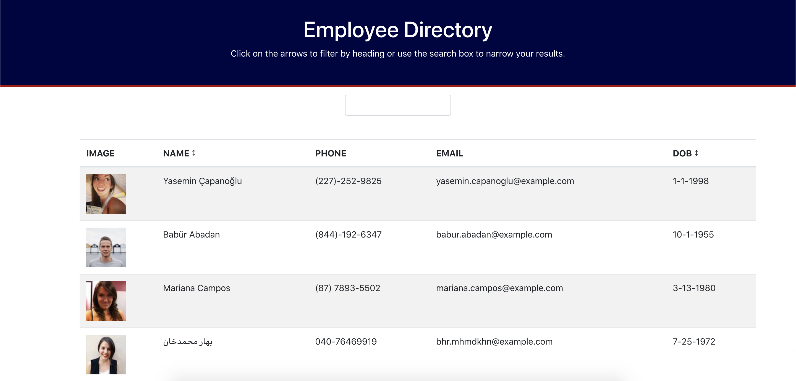

# Employee Directory
      
    


## Description

This employee directory react.js application lets you search and sort a list of employees. First, we make an axios call to a user database, then render each users picture, full name, phone number, email address, and date of birth. The user is then able to search through the list of employees by means of a search box. You can search by any column you want and the list will be dynamically updated as you type. You can also sort the employees alphabetically by name or by age, acending or decending. This app utilizes React.js, axios, Bootstrap, JavaScript, JSX, and CSS.

## [Click Here to check it out!](https://jacoblovins.github.io/employee_directory/)


​


## Table of Contents

* [Installation](#installation)
* [License](#license)
* [Questions](#questions)


## Installation

To install necessary dependencies, run the following command:

``` npm i ```


## License

This project is licensed under the APACHE 2.0 license.


## Questions

If you have any further questions, you can reach me directly here: lovins.jacob@yahoo.com

You can find more of my work at [https://github.com/jacoblovins/](https://github.com/jacoblovins/).
